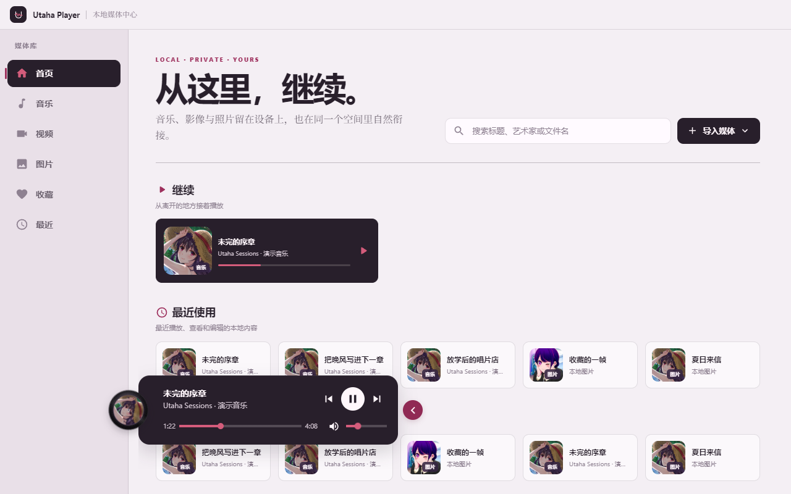
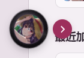
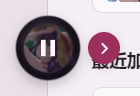
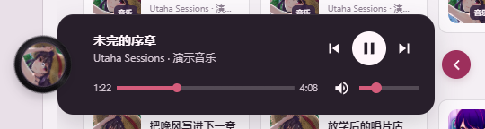
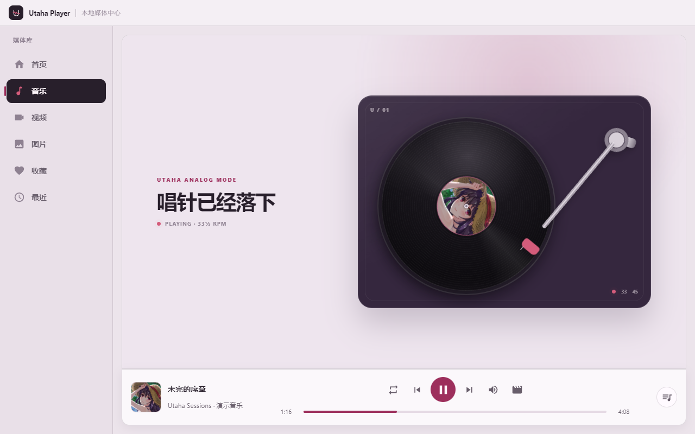
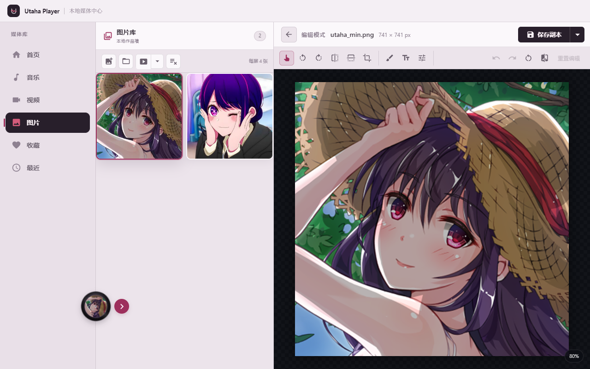

<div align="center">

<a href="./README.md">中文</a> · <a href="./README.en.md"><strong>English</strong></a>

<br>


# Utaha Player

**Keep your favorite melodies, stories, and moments close.**

A local-first desktop media center · Music / Video / Photos

✒️ By the written page and the spinning record. Do meet your deadline today, Author-kun.

**[Download for Windows](https://github.com/volkgrenadier/UtahaPlayer/releases/download/v0.2.1/Utaha.Player-0.2.1.Setup.exe)** · [v0.2.1 release notes](https://github.com/volkgrenadier/UtahaPlayer/releases/tag/v0.2.1) · [Feedback & ideas](https://github.com/volkgrenadier/UtahaPlayer/issues)

</div>

> “Since you're here, sit down and listen to the whole song. As for the next update… Author-kun, I do remember that ‘tomorrow, I promise.’”

Utaha Player brings local music, videos, and photos into one library. Files and activity records stay on your device, with no account required. Open the app and pick up where you left off.

A little deep plum, a little berry red, and a little devotion to the Cult of Utaha: treasure what you love, leave room for the next chapter, and let the unfinished song keep playing.

## ✨ Your screening room, record shop, and photo desk

| | What you can do |
| --- | --- |
| 🎵 Music & lyrics | Enjoy a vinyl turntable view, immersive lyrics, playlists, and sequential, shuffle, or repeat-one playback. |
| 📀 Floating vinyl | Keep listening across pages. Hover over the rotating cover to play or pause; expand the tile for track, seek, and volume controls. |
| 🎬 Resumable video | Save playback progress, pause automatically when leaving the video page, and continue next time. |
| 🖼️ Photo workspace | Preview images and run slideshows. Crop, rotate, flip, adjust colors, add text, or draw at source resolution, with undo and redo. |
| 🗂️ One media library | Continue, Recently Used, and Recently Added on the home page, alongside unified search, favorites, and activity history. |
| 🪟 Desktop details | Native window dragging, a responsive sidebar, Windows Mica where available, visible keyboard focus, and reduced-motion support. |

## 📸 Take a look around

These screenshots show the **v0.2.1 Windows app**, using artwork already in the repository and local demo media.

### Pick up where you left off



### A small record, with your controls close at hand

<table>
  <tr>
    <th>Collapsed · room to breathe</th>
    <th>Hover · play / pause</th>
    <th>Expanded · all within reach</th>
  </tr>
  <tr>
    <td align="center"></td>
    <td align="center"></td>
    <td align="center"></td>
  </tr>
</table>

The record appears after the first music playback of each app session and remains when paused. It uses the track's cover when available, with a default vinyl design as a fallback. Click the arrow to slide out the controls. The tile collapses three seconds after you leave it, or when you press `Escape`.

<details>
<summary>🎵 Open the music page: the needle has landed</summary>



</details>

<details>
<summary>🖼️ Open the photo workspace: keep a favorite frame</summary>



</details>

## 📦 Take it home

The current prebuilt installer is **Windows x64 · v0.2.1**.

1. [Download the installer](https://github.com/volkgrenadier/UtahaPlayer/releases/download/v0.2.1/Utaha.Player-0.2.1.Setup.exe) and run `Utaha.Player-0.2.1.Setup.exe`.
2. Open the app and use **导入媒体** (Import Media) on the home page to choose a music, video, or photo folder.
3. Play a song, return home, and try the floating record beside the sidebar.

The [release page](https://github.com/volkgrenadier/UtahaPlayer/releases/tag/v0.2.1) also provides update files and `SHA256SUMS.txt` for verification. The installer does not require a development environment.

## 🗝️ Your collection stays yours

- Imported media stays in its original location. The library index, playback progress, preferences, and thumbnails are stored in the app's local data directory.
- Photo editing defaults to **Save Copy**. Overwriting the original requires confirmation and uses file validation and a replacement process that supports rollback.
- Edited GIFs are exported as static PNG images.

## 🛠️ Help write the next chapter

You will need Node.js and npm. Use the `master` branch for the current source. The first dependency installation downloads files including Electron and FFmpeg.

```bash
git clone --branch master https://github.com/volkgrenadier/UtahaPlayer.git
cd UtahaPlayer
npm ci
```

Start the frontend in one terminal:

```bash
npm start
```

Start the desktop app in a second terminal:

```bash
npm run electron
```

Run checks and create a production build:

```bash
npm test -- --watchAll=false --runInBand
npx eslint src --ext .js --max-warnings=0
npm run build
```

Build the x64 installer on Windows:

```bash
npm run build
npm run make -- --platform=win32 --arch=x64
```

Installer output: `out/make/squirrel.windows/x64/`.

**Built with:** Electron 34 · React 19 · React Router · Material UI 6 · electron-store · Konva / React Konva · FFmpeg / FFprobe · music-metadata.

The v0.2.1 release passed **18 suites / 91 tests**, lint checks, and a production build, plus packaged-app checks for startup, media access, player interactions, and multiple window sizes and display scales.

## ✒️ The Cult of Utaha · Summoning Author-kun

> Author-kun. Oh, Author-kun—
>
> A fresh page is waiting. We've even replaced your cold coffee.
>
> Is your next update still hiding behind the bookmark marked “tomorrow, I promise”?
>
> **𓀃𓀅𓀇𓀋𓀌**
>
> Return to us… crack the long whip, gather the six reins, and bring the unfinished chapter home.
>
> **𓀌𓀎𓀠𓀤𓀫**
>
> Return to us… sing your way across the mountains; follow the sound of the needle touching vinyl.
>
> **𓀋𓀌𓀎𓀙𓀠**
>
> Return to us… raise a song of triumph; spare the waiting pages another coat of dust.
>
> **𓀋𓀠𓀤𓀥𓀫**
>
> Return to us… Senpai has closed her book. The page she saved for you is still blank.

### According to our rather questionable field research

| Updates from Author-kun | What happens around the writing desk |
| --- | --- |
| **One** | Tiny flaws grow enormous. Awkward code gets circled in red. “This part. Rewrite it. Don't look at me like that.” |
| **Two** | A little patience appears. Readers start paying attention to where the story is going. “The next chapter… I might take a look.” |
| **Three** | Quiet praise finds its voice. Dormant bookmarks wake up, and fewer readers slip away without a word. |
| **Five** | Readers begin defending the work of their own accord. “He's putting in the effort. Look—this part is good.” |
| **Ten** | The lore scholars are debating at full volume. Generosity fills the room. “Brilliant! A Kasumi Utako-style use of narrative silence!” |

**Today's doctrine: put the song on repeat. Author-kun's “tomorrow, I promise” can have a rest.**

Be gentle with requests for updates and specific with feedback. Bring reproduction steps, your environment, or a screenshot to an [Issue](https://github.com/volkgrenadier/UtahaPlayer/issues), or contribute an improvement. Let's make the next update worth waiting for.

---

The name Utaha is a nod to Kasumigaoka Utaha. The header illustration comes from the project's existing assets; the senpai-style lines and summoning ritual are playful writing for this project.

<div align="center">

**May the playlist never end, and the next chapter arrive on time.**

<a href="./README.md">中文</a> · <a href="./README.en.md"><strong>English</strong></a>

</div>
